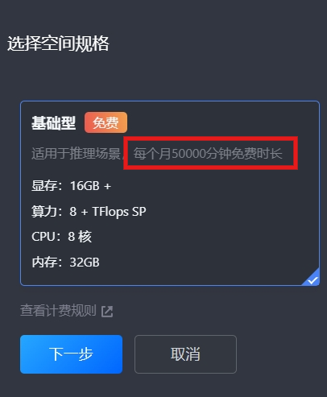

## [关于Cloud Studio](https://ide.cloud.tencent.com/)

### [视频教程]()

### 配置：

[ cloud studio 网址 ](https://ide.cloud.tencent.com/) 注册白嫖吧。

## 每月免费50000分钟，相关 *使用技巧*  及 *Ngrok部署教程* 放在以下链接了，关注后取用吧。

## 【[BiLibili工房](https://gf.bilibili.com/item/detail/1107164073)】

### 提示：Ngrok部署很简单的。

### [Cloud Studio 安装ollama及Qwen2.5 Coder 32B示范](https://www.bilibili.com/video/BV1VYUAYZEH7/)

[良心云第一弹](https://www.bilibili.com/video/BV1BJmSYFE2a)
[良心云第二弹](https://www.bilibili.com/video/BV1QEmrYZEtt/)
[良心云第三弹](https://www.bilibili.com/video/BV1VYUAYZEH7/)
同类推荐：
[https://www.bilibili.com/video/BV1JRStYCEsU/](https://www.bilibili.com/video/BV1JRStYCEsU/
)
[https://www.bilibili.com/video/BV1nS421d72h/](https://www.bilibili.com/video/BV1nS421d72h/)
[https://www.bilibili.com/video/BV1cC411n7gB/](https://www.bilibili.com/video/BV1cC411n7gB/)
[https://www.bilibili.com/video/BV1an4y1X7h5/](https://www.bilibili.com/video/BV1an4y1X7h5/)
[https://www.bilibili.com/video/BV1Ey411i7R2/](https://www.bilibili.com/video/BV1Ey411i7R2/)

