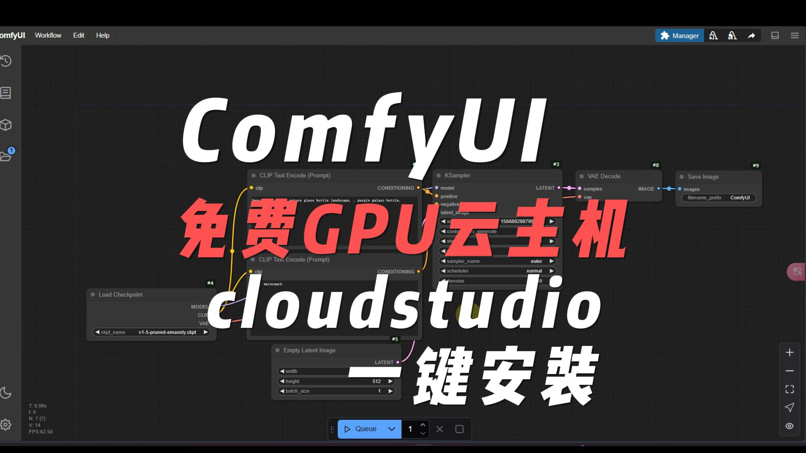

## [关于Cloud Studio](https://ide.cloud.tencent.com/)

交流群：

企微  https://qr61.cn/oohivs/qRp62U6

Discord https://discord.gg/3JWMgKQznF

### [视频教程]()

### 配置：

[ cloud studio 网址 ](https://ide.cloud.tencent.com/) 注册白嫖吧。

## 每月免费50000分钟，相关 *使用技巧*  及 *Ngrok部署教程* 放在以下链接了，关注后取用吧。

### 【[BiLibili工房](https://gf.bilibili.com/item/detail/1107164073)】
### 【[获取更多脚本](https://gf.bilibili.com/item/detail/1107198073)】 

[良心云第一弹](https://www.bilibili.com/video/BV1BJmSYFE2a)

[良心云第二弹](https://www.bilibili.com/video/BV1QEmrYZEtt/)

[良心云第三弹](https://www.bilibili.com/video/BV1tmSFY1ERb/)【一键安装open webUI】

[良心云第四弹](https://www.bilibili.com/video/BV1nMzNYHEd6/)【一键安装ComfyUI + Ngrok】

### 提示：Ngrok部署很简单的。

### [Cloud Studio 安装ollama及Qwen2.5 Coder 32B使用示范](https://www.bilibili.com/video/BV1VYUAYZEH7/)

