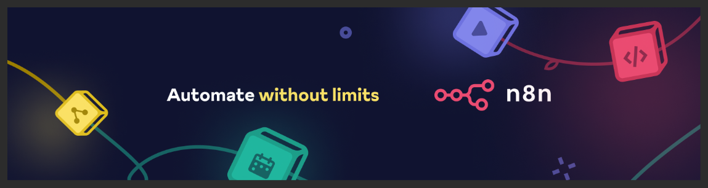
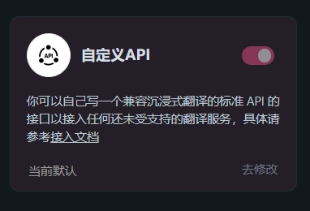
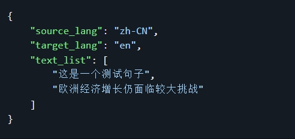
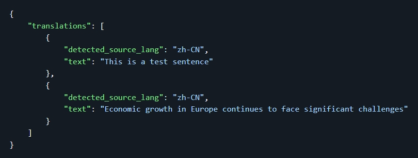

## 本期视频内容要点

【沉浸式翻译自定义API部署指南+N8N更好可定制化翻译工作流:用N8N打造你的专属翻译神器-N8N教程[本期视频](https://www.bilibili.com/video/BV1PZy2YdErb/)】

- 上期我们通过免费部署 DeepL 的 API 来实现沉浸式翻译，今天我们通过 n8n 来部署一个自定义的 API 来实现沉浸式翻译。

- N8N 通过 Webhook 来接收沉浸式翻译的请求，然后调用主流大语言模型来翻译文本，最后将翻译后的文本返回给沉浸式翻译。我们将详细讲解这个过程。

## 部署自定义 API

现在我们开始用 n8n 部署一个自定义的 API 来使用沉浸式翻译。

1、明确沉浸式翻译的流程

- 沉浸式翻译向 自定义 API 发送请求及需要翻译的文本:此 API 是 N8N 的 Webhook

- 翻译文本:N8N 收到请求后自动调用主流大语言模型来翻译文本，得到翻译后的文本

- 返回翻译后的文本:N8N 将翻译后的文本返回给沉浸式翻译

- 沉浸式翻译将翻译后的文本展示在界面上

2、自动义 API 的格式   

参考官方说明：https://immersivetranslate.com/zh-Hans/docs/services/custom/

3、部署自定义 API【N8N自动化工作流】

查看详细的工作流 [n8n-fanyi-api.json](https://aigenai-aiflow.hf.space/workflow/eGgX67kijOCxwR8h)

### 实测

1、用沉浸式翻译测试自定义 API 连通性

2、用自定义 API 测试沉浸式翻译网页内容

3、用自定义 API 测试文件翻译

## 部署 n8n

### N8N 部署方式

1、可在本地部署【[官网](https://docs.n8n.io/hosting/)】

2、HuggingFace部署【免费】【推荐】【[视频教程](https://www.bilibili.com/video/BV1e6sVeEEhR/) [项目地址](https://github.com/aigem/n8n-serv00)】

3、Serv00部署【免费】【推荐】【[视频教程](https://www.bilibili.com/video/BV1PZy2YdErb/) [项目地址](https://github.com/aigem/n8n-serv00)】

### 相关链接：

免费部署 DeepL 的 API 来实现沉浸式翻译 【[视频教程](https://www.bilibili.com/video/BV1e9bceoECw/) [项目地址](https://github.com/aigem/deeplx-freeAPI-serv00)】

相关链接我会放到视频下方的。

### 相关资源

n8n 工作流文件 [workflow.json](../src/n8n-fanyi-api.json/)

## 本期视频总结

- 通过 n8n 部署一个自定义的 API 来实现沉浸式翻译，可以大大提高翻译的准确性及翻译的质量。

- 通过 n8n 部署一个自定义的 API 来实现沉浸式翻译，可以实现特殊的翻译需求及翻译的个性化。

- 所有软件、服务、LLM 模型、API 都是免费的，可以大大降低成本。

