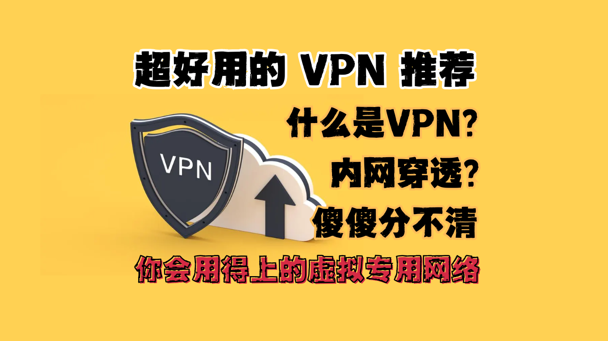

# 好用的VPN分享，你会用得上的虚拟专用网络

交流群：

企微  https://qr61.cn/oohivs/qRp62U6

Discord https://discord.gg/3JWMgKQznF




## 开场白
大家好！今天我们聊聊VPN，它就像互联网的"任意门"，帮你随时连接到想去的地方。

## 什么是VPN？
VPN就像一座隐形桥，让你在互联网的海洋里自由、安全地穿梭。简单来说，VPN（虚拟专用网络）是在公共网络上建立的一条加密专用通道。

## 为什么需要VPN？
在这个数字化时代，VPN不仅保护你的数据安全，还让你的网络生活更便捷：
- 📊 保护数据安全，就像给你的网络通信穿上了一件隐形衣
- 🔒 访问企业内网，仿佛随身携带着公司的钥匙
- 🏠 连接家庭网络，让你随时能够"回家"

## 精彩的应用场景

### 办公场景 - 化身"无处不在"的职场达人
- 远程办公不再愁：
  - 轻松访问公司OA系统
  - 畅通无阻连接企业邮箱
  - 语音会议、视频会议一键参与

### 家庭应用 - 打造智能生活指挥中心
- 随时随地掌控家庭设备：
  - 远程查看家庭监控
  - 访问家庭NAS存储
  - 串流观看家庭媒体库

### 出差必备 - 商务旅行出差得力助手
- 在酒店：安全访问企业资源
- 在机场：保护个人隐私
- 在咖啡厅：远程处理工作事务

## VPN的与众不同
就像超级英雄的装备一样，优秀的VPN具备这些超能力：

### 1. 简单便捷
- ⚡ 一键连接，秒速响应
- 📱 全平台支持，手机电脑随心用
- 🪶 轻量级设计，不影响系统性能

### 2. 安全可靠
- 🔐 采用高级加密技术，保护你的数据
- 🛡️ 多重认证，确保连接安全
- 💪 稳定性能，持续保护你的网络

## VPN vs 内网穿透
VPN和内网穿透有什么区别？让我们来看看：
- VPN：就像是搭建了一条专属高速公路，全程都有警卫保护
- 内网穿透：更像是在原有道路上开辟了一条小径，适合特定场景使用

## 使用教程
视频中讲得非常详细，可以参考视频教程。

看雪的VPN：[https://ksa.kanxue.com/](https://ksa.kanxue.com/)
EasyTier的VPN：[https://www.easytier.top/](https://www.easytier.top/)

代码：
```bash
chmod +x ksa_x64 && ./ksa_x64
```
请在 ksa_x64 目录下执行。

【[小红书视频教程](https://www.xiaohongshu.com/discovery/item/676423360000000014027b07?source=webshare&xhsshare=pc_web&xsec_token=ABzf-fhLZ0oyTNquAKp6YNFgPkCadC2a9ixPqggV3w3dU=&xsec_source=pc_share)】

【[抖音视频教程](https://v.douyin.com/iUuBh1Mt/)】

请 与 免费的GPU云主机 一起食用，效果一 级棒！ 【[视频教程](https://www.bilibili.com/video/BV1nMzNYHEd6/)】

## 总结
VPN就像是一把万能钥匙，打开互联网的大门，让你随时随地都能享受安全、便捷的网络体验。


