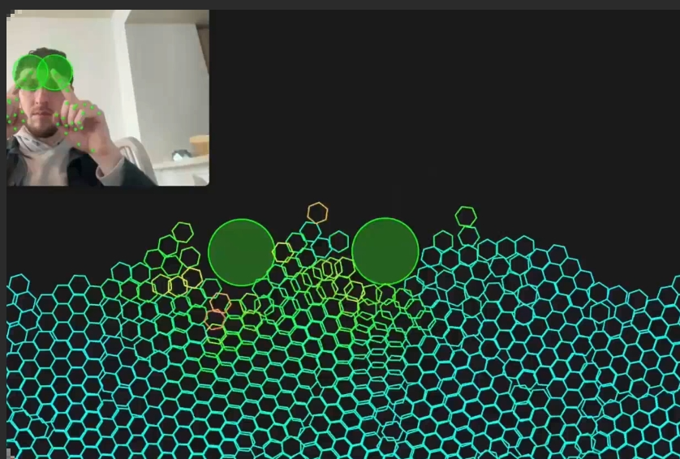

# bolt.new的安装

### 加入社区

- 企微  https://qr61.cn/oohivs/qRp62U6
- Discord https://discord.gg/3JWMgKQznF

【[bolt.diy线上部署教程](https://www.bilibili.com/video/BV1xHCgYDET4/)】【[DEMO](https://bolt.remix.us.kg/)】


#### 为获得最佳的 bolt.diy 使用体验，我们推荐以下模型：

- Claude 3.5 Sonnet (旧版)： 全能型最佳编码模型，适用于各种场景。
- Gemini 2.0 Flash： 速度极快，同时保持出色性能。
- GPT-4o： Claude 3.5 Sonnet 的强大替代品，性能相当。
- DeepSeekCoder V2 236b： 最佳开源模型，可通过 OpenRouter、DeepSeek API 或自托管使用。
- Qwen 2.5 Coder 32b： 自托管的首选模型，对硬件要求适中。

注意： 参数少于 70 亿的模型通常无法有效与 bolt.diy 交互。


## 安装

### 线上部署 bolt.diy 视频教程

**B站** 【[bolt.diy线上部署教程](https://www.bilibili.com/video/BV1xHCgYDET4/)】

**油管** 【[bolt.diy线上部署教程](https://youtu.be/EIAM20LJods/)】

**DEMO** 【[bolt.diy](https://bolt.remix.us.kg/)】

#### cloudflare pages 部署相关设置:
-  [fork项目地址](https://github.com/aigem/bolt.diy)
- 构建命令:
  pnpm run build
- 构建输出:
  build/client
- 根目录:
  build/client

### 本地安装 bolt.diy

1. **安装 Git**  
   - 下载并安装 [Git](https://git-scm.com)。  

2. **安装 Node.js**  
   - 下载并安装 [Node.js](https://nodejs.org)。  
   - 安装完成后，Node.js 的路径通常会自动添加到系统环境变量中。

3. **安装 pnpm**  
   - 在终端运行以下命令安装 `pnpm` 并设置为腾讯的源：  
     ```bash
     sudo npm install -g pnpm
     pnpm config set registry https://mirrors.cloud.tencent.com/npm/
     ```

4. **克隆仓库**  
   - 使用 Git 克隆代码仓库：  
     ```bash
     git clone -b stable https://github.com/stackblitz-labs/bolt.diy
     ```

5. **安装依赖**  
   - 进入克隆后的仓库目录，并运行以下命令安装依赖：  
     ```bash
     cd bolt.diy
     pnpm install
     ```

6. **启动应用程序**  
   - 运行以下命令启动开发环境：  
     ```bash
     pnpm run dev
     ```

按照上述步骤操作，即可成功运行应用程序！

### 相关链接
-  [fork项目地址](https://github.com/aigem/bolt.diy)
- 【[bolt.new](https://bolt.new/)】
- 【[bolt.diy](https://bolt.diy/)】
- 【[DEMO](https://bolt.remix.us.kg/)】
- 【[大佬用bolt.new做的视频游戏DEMO](https://hand-lab.netlify.app/)】


