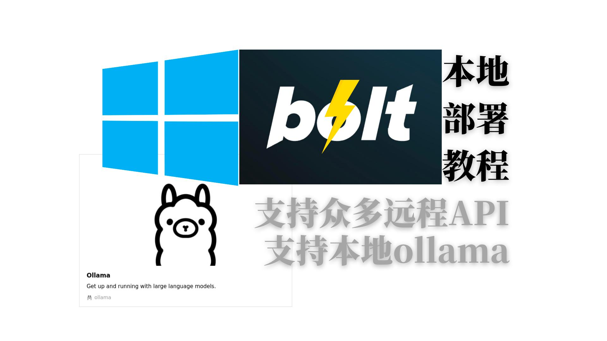

# 安装相应工具（可选）
```bash
apt update
apt install curl -y
```



## 相关链接
【[视频教程](https://www.bilibili.com/video/BV1V1DHYJE6h/)】
【[watt toolkit使用](https://www.bilibili.com/video/BV1zT421979q/)】

# 检查是否安装了git
```bash
git --version
```

# 检查是否安装了node
```bash
if [ -z "$(node -v)" ]; then
  echo "node is not installed"
  # 安装node 20
  curl -sL https://deb.nodesource.com/setup_20.x | bash -
  apt-get install -y nodejs
fi
```

# 设置npm源为腾讯源
```bash
npm config set registry https://mirrors.cloud.tencent.com/npm/
```

# 检查是否安装了pnpm
```bash
if [ -z "$(pnpm -v)" ]; then
  echo "pnpm is not installed"
  # 安装pnpm
  npm install -g pnpm
fi
```

# 设置pnpm源为腾讯源
```bash
pnpm config set registry https://mirrors.cloud.tencent.com/npm/
```

# git clone
```bash
git clone https://github.com/coleam00/bolt.new-any-llm.git
cd bolt.new-any-llm
pnpm install
mv .env.example .env.local
```

# 填入API KEY
  在.env.local文件中填入API KEY

## 获取mistral.ai的API KEY
https://mistral.ai/

## 使用ollama
https://ollama.com/
默认端口为11434，API地址为http://localhost:11434

# 运行 （windows）
```bash
pnpm run dev
```

【[视频教程](https://www.bilibili.com/video/BV1V1DHYJE6h/)】