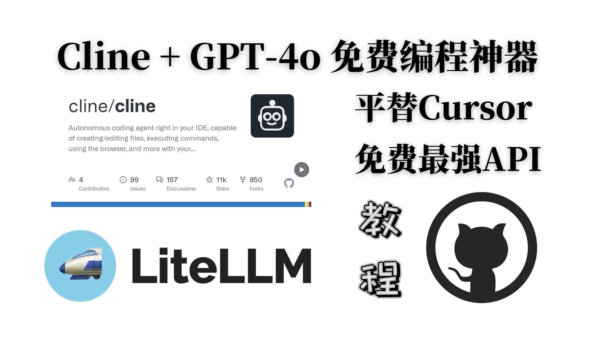

# 【平替cursor新选择】Cline + litellm + Gpt-4o API 本地及云端部署教程

交流群：

企微  https://qr61.cn/oohivs/qRp62U6

Discord https://discord.gg/3JWMgKQznF

本指南提供了在本地和云端IDE中安装和使用Cline + litellm + Gpt-4o API 的说明。

## 视频教程

视频教程请点击【[这里](https://www.bilibili.com/video/BV1DJDDYfEfD/)】



## IDE安装

### 本地IDE
- Visual Studio Code (VSCode)

### 云端IDE
- Marscode IDE（如前所述）

## 安装 litellm

### 什么是 litellm?
Litellm 是一个用于与语言模型交互的轻量级库。

### 安装命令
要安装 litellm，请运行以下命令：

```bash
pip install litellm

# 安装litellm 需要的依赖，requirements.txt 内容在附录
pip install -r requirements.txt
```

### 设置环境变量
确保您已设置必要的API密钥：

```bash
export GITHUB_API_KEY=your_github_api_key_here
```

将 `your_github_api_key_here` 替换为您的实际GitHub API密钥。

### 运行 litellm
要使用 GPT-4o 模型运行 litellm，请使用以下命令：

```bash
litellm --model github/gpt-4o
```

## 获取 GitHub 模型 API [获取免费GPT-4o API教程](https://www.bilibili.com/video/BV1KcDwYUEC6/)
要获取 GitHub 模型 API，请访问以下链接：[GitHub Models Marketplace](https://github.com/marketplace/models)

视频教程请点击[这里](#)。

## 测试使用 Gpt-4o API 来编程
您可以在本地和云端IDE中测试 Gpt-4o API。

## 部署 litellm 以便日常使用
### 一键部署
- 使用项目首页的一键部署选项。

### Hugging Face 部署
- 在 Hugging Face 上复制项目进行部署。更多详情请参阅下面链接的视频。

## 其他资源
- [视频教程](https://www.bilibili.com/video/BV1DJDDYfEfD/)
- [相关IDE介绍](./2.md)
- [LiteLLM项目主页](https://github.com/BerriAI/litellm)
- [Cline项目主页](https://github.com/claude-ai/cline)
- [获取免费GPT-4o API](https://www.bilibili.com/video/BV1KcDwYUEC6/)

## 附litellm 需要的依赖：requirements.txt
```
python-dotenv==1.0.0 # for env
tiktoken==0.7.0 # for calculating usage
importlib-metadata==6.8.0 # for random utils
tokenizers==0.14.0 # for calculating usage
click==8.1.7 # for proxy cli
jinja2==3.1.4 # for prompt templates
certifi==2024.7.4 # [TODO] clean up
aiohttp==3.10.2 # for network calls
tenacity==8.2.3 # for retrying requests, when litellm.num_retries set
pydantic==2.7.1 # proxy + openai req.
jsonschema==4.22.0 # validating json schema
websockets==10.4 # for realtime API
fastapi==0.111.0 # server dep
backoff==2.2.1 # server dep
orjson==3.9.15 # fast /embedding responses
Pillow==10.3.0
gunicorn
pyyaml
apscheduler
cryptography
opentelemetry-api==1.25.0
opentelemetry-sdk==1.25.0
opentelemetry-exporter-otlp==1.25.0
```
